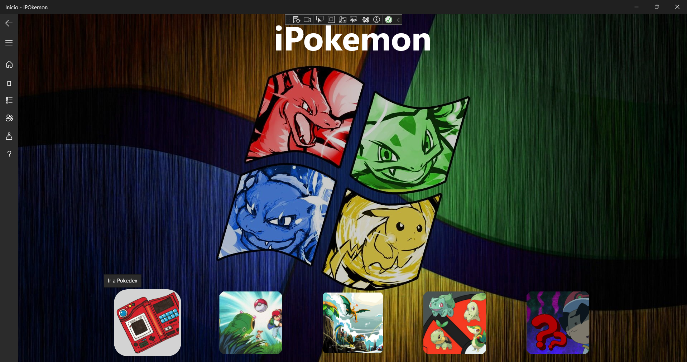
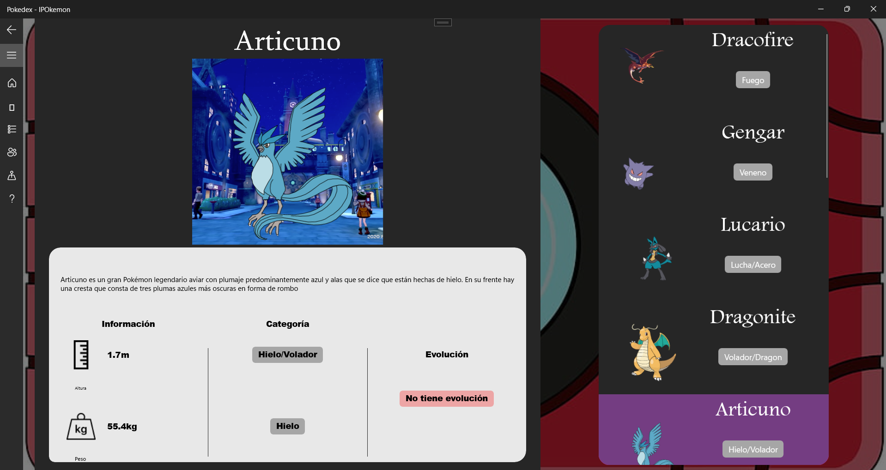
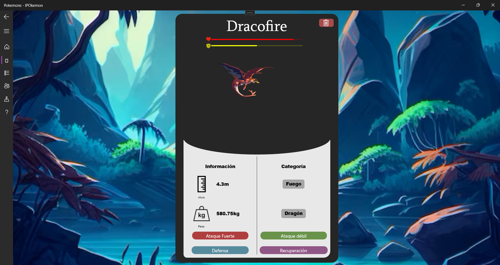
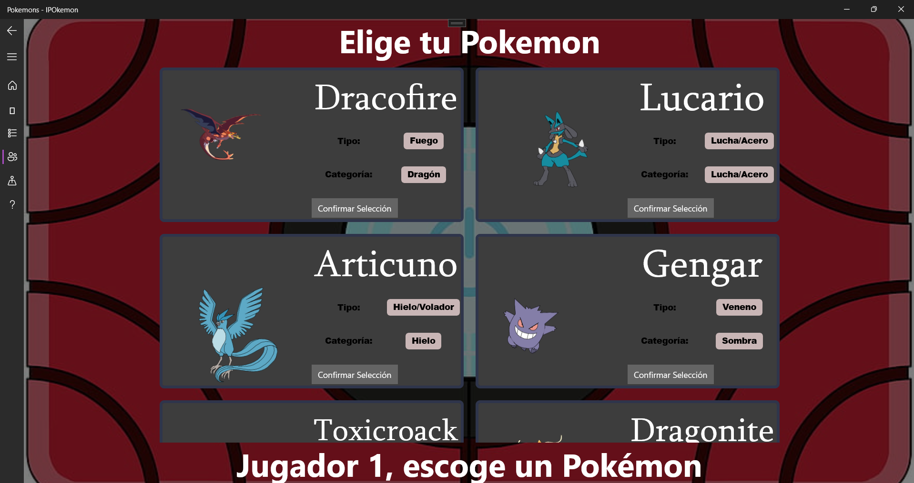
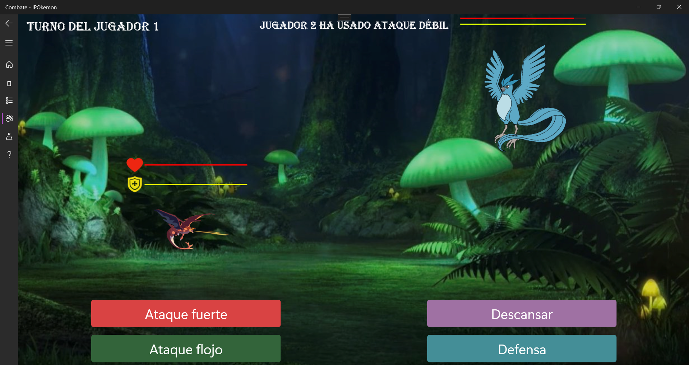
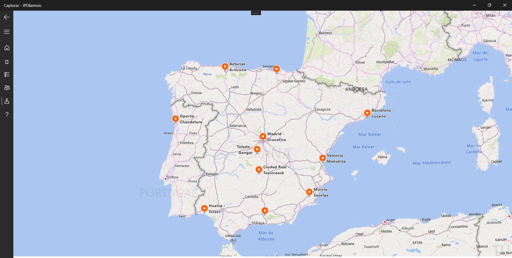
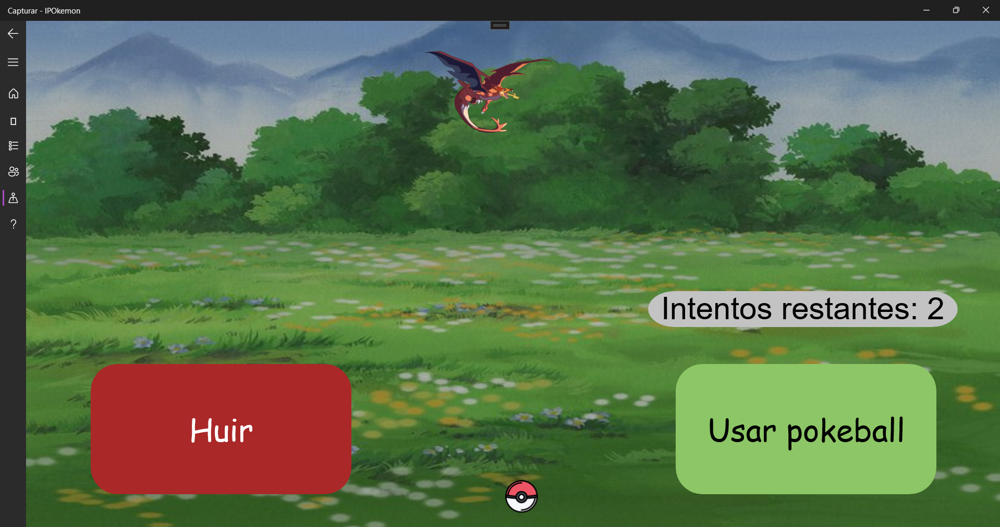

<!-- @format -->

# ipokemon

<h1 align="center"> IPOkemon </h1>



## ¿En qué consiste este proyecto?

Vamos a realizar una aplicación para la asignatura de Interacción Persona Ordenador, consistirá en una aplicación Windows Universal (UWP) llamada: IPOkemon, que simulará el juego pokemon ya que tendremos que hacer varios diseños en Blend con WPF y posteriormente añadir animaciones a estos diseños en UWP. La aplicación manejará todos los controles de usuario de estos diseños con sus respectivas animaciones para simular funcionalidades del juego como Pokedex, Combate, Pokemons Caputurados e información de estos.
Esto se consigue siguiendo los flujos de diseño de Microsoft Windows 11, como son: ListView, GridView, Frame, NavigationView, etc...

Proyecto realizado con la herramienta Visual Studio.
Lenguaje de programación C#, UWP .NET.

## Construido con 🛠️

_Herramientas tecnológicas utilizadas para crear el proyecto:_

- [Git](https://git-scm.com/downloads) - Para el control de versiones
- [Visual Studio](https://visualstudio.microsoft.com/es/downloads/) - IDE de la aplicación
- [Xalm](https://learn.microsoft.com/es-es/dotnet/desktop/wpf/xaml/?view=netdesktop-8.0) - Lenguaje de marcado para la interfaz
- [C#](https://learn.microsoft.com/es-es/dotnet/csharp/) - Lenguaje programación

### Pre-requisitos 📋

_Descargar el proyecto utilizando:_

```
git clone https://github.com/gonzalodlr/ipokemon.git
```

_Descargar las tecnologías necesarias con las que se construyó el proyecto [Tecnologías](#construido-con-️)_

### Instalación 🔧

_Una vez se han realizado los [Pre-requisitos](#pre-requisitos-)_

Abrir el archivo "App Pokemon.sln" y ejecutar el proyecto.

## Contribuyendo 🖇️

Si quiere contribuir, contacte conmigo.

## Tutorial

### Página Pokedex



### Página Pokemons



### Página Elegir Pokemon Combate



### Página Combate


### Usando ataque flojo:



### Página Mapa de Captura



### Página Captura Pokemon



## Autores ✒️

_Creadores de este proyecto_

- **Gonzalo De Los Reyes Sánchez**
- **Javier Cuartero**

## Features 🎁

- Mejorar adaptabilidad de algunas interfaces
- Añadir lenguajes
- Añadir más funcionalidades: Entrenamiento, Evolución, etc...
- Mejorar calidad de interfaces
- Agregar narración
- Mejorar lógica combate para añadir ataques críticos y/o débiles.
